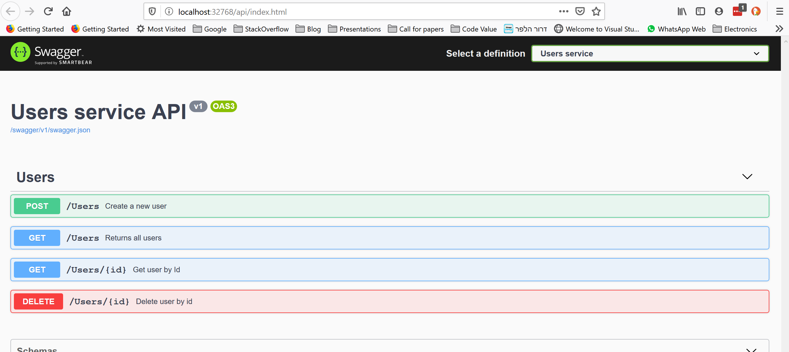

# Create an ASP.NET Core service with PostgreSQL and Marten

## prerequisites
This exercise is meant top be run on Windows using Visual Studio 2019 and .NET Core 3.1.

### Docker
In this exercise we will use Linux containers and so you'll need to [download and install Docker](https://docs.docker.com/docker-for-windows/install/) on your develpoment machine.

### Visual Studio 2019 (and edition)
[Download the latest installer](https://visualstudio.microsoft.com/downloads/) and run it, make sure to install ASP .NET  development especialy .NET Core support

### .NET Core 3.1
If you do not have the LTS version of .NET Core 3.1 installed [download the SDK microsoft](https://dotnet.microsoft.com/download/dotnet-core)

## Testing your environment
Once you've opened the solution in Visual Studio, check that the current debug run is set to _docker compose_: 
* If you do not see Docker Compose as a valid value open Solution Explorer and right click on the docker-compose file and choose __Set as StartUp Project__

Press __F5__, after a few minutes a broswer window should open with the swagger page of the users service that has four different operations. 

When we add more functionlity to the users serviuce you can run the solution the same way, test the functionality and debug your code.

_Now you can stop the debugging session and start adding functionality to the new service._

## Running the tests
You can either run the tests from the command line using:   
_dotnet test UsersService.sln_  
or from within Visual Studio using:  
_Ctrl + R, A_ to run all tests

## 1 - Add User's repository to dependency injection.
In __Startup.cs__ file add the following line inside __ConfigureServices__ method:
```
services.AddScoped<IUsersRepository, UsersRepository>();
```
So that the method would look something like this:
```
public void ConfigureServices(IServiceCollection services)
{
    services.AddControllers();

    services.AddScoped<IUsersRepository, UsersRepository>();
```
Next open __UsersController.cs__ and add _IUserRepository_ as a parameter to the class constructor:
```
public UsersController(IUsersRepository userRepository ...
```
Then store that value in a field inside __UsersController__

## 2 - Add call to user repository from controller
Inside _UsersController.CreateNewUser_ add a call to user repository passing the data we've recieved from User create.

## 3 - implement create new user in repository
In __Startup.cs__ file add the following line inside __ConfigureServices__ method:
```
services.AddScoped<IDocumentStoreFactory, DocumentStoreFactory>();
```

Next make sure that IDocumentStoreFactory is passed to the UsersRepository constructor and it's value is save in a field:
```
UsersRepository(IDocumentStoreFactory documentStoreFactory){
    _documentStoreFactory = documentStoreFactory;
}
```
Finally you'll need to open a new session to the DB using the _documentStoreFactory_ then store the new value and then call _Save_.
Add the following code Inside __UsersRepository.CreateNewUser__:
```
public int CreateNewUser(string name, string email, int age)
{
    var newUser = new User
    {
        Name = name, 
        Email = email, 
        Age = age
    };

    using (var session = _documentStoreFactory.Store.OpenSession())
    {
        session.Store(newUser);

        session.SaveChanges();
    }

    return newUser.Id;
}
```
All of the tests starting with "Test1_", "Test2_" and "Test3_" should pass now, and you can start a debugging session and create a new user using swagger, notice that an  Id (int) is returned when the method runs

## 4 - implement get user by id
Now that you know how to use the controller and repository in order to update the database you can add the ability to get a user by it's id (the valuem returned when we've created a new user).
Start by adding a call inside the controller's method _GetUserById_:
```
/// <summary>
/// Get user by Id
/// </summary>
[HttpGet("{id}")]
public User GetUserById(int id)
{
    return _usersRepository.GetUserById(id);
}
```
Next implement UsersRepository.GetUserById method.
First open a new session using __documentStoreFactory.Store_ but this time instead of opening a "regular session" we'll opne a query session:
```
using (var session = _documentStoreFactory.Store.QuerySession())
{

}
```
Inside the using block add a call to _session.Load_ using the user type and user Id passed to the method:
```
using (var session = _documentStoreFactory.Store.QuerySession())
{
    return session.Load<User>(id);
}
```
All of the tests that starts with _Task4__ should pass and now you can start a new debug run, create a new user and then retrieve it.

## 5 - implement delete user by Id
Deleting a user will be done by opening a new session then calling `session.Delete<User>(id);` followed by `session.SaveChanges`.
After you've added a call to the _UsersRepository_ from within _UsersController_ passing the id of the user to delete add the following code to delete:
```
using (var session = _documentStoreFactory.Store.OpenSession())
{
    session.Delete<User>(id);

    session.SaveChanges();
}
```

## Summary
In this tutorial you've written an  __ASP.NET Core__ micro service that uses __Marten__ to create, get and delete a User in __PostgreSQL__ using Marten.
Feel free to try it out, either from it's swagger page or by using http calls from other tools such as _Postman_ or _curl_.